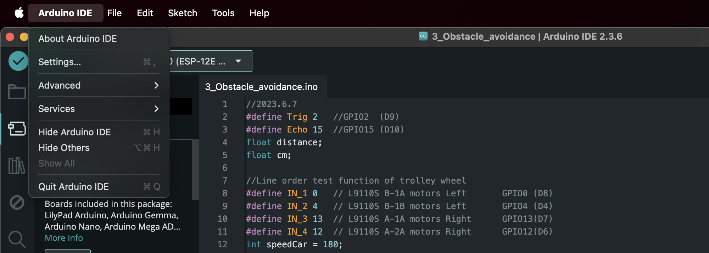
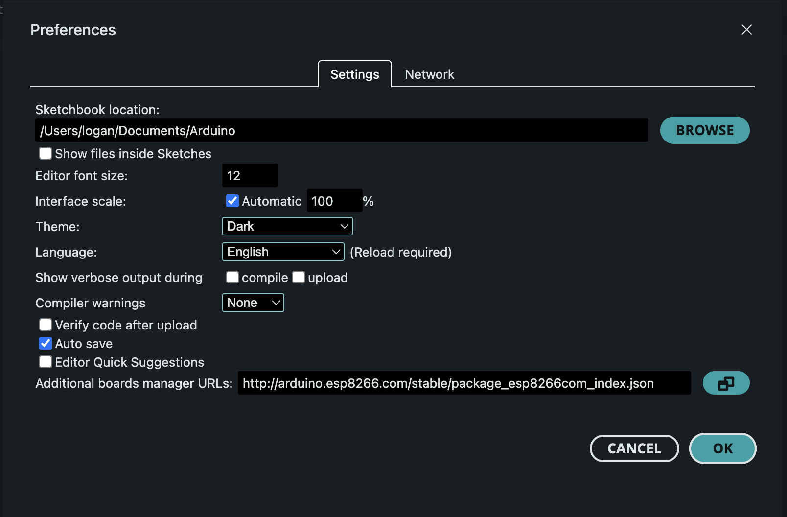
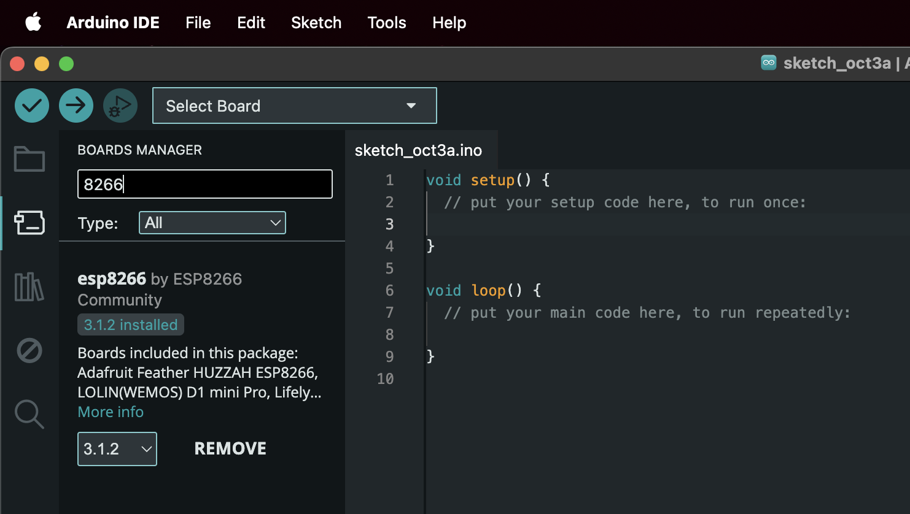
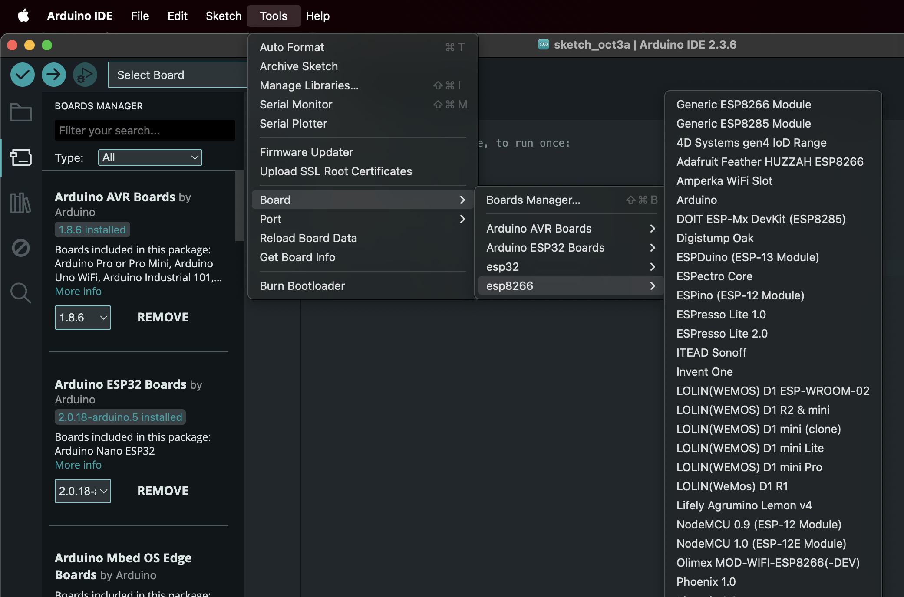

# Obstacle Avoidance Robot

## Arduino IDE Configuration Settings

### Open Arduino IDE → Settings
Mac

### Add ESP8266 Board Manager URL

Add board manager URL: 
http://arduino.esp8266.com/stable/package_esp8266com_index.json

Selct OK to exit settings.

### Open Board Manager

Go to Tools → Board → Boards Manager

### Search for “ESP8266”

It should now appear as esp8266 by ESP8266 Community.

### Install the Package

Click Install. Wait for it to finish.

### Select Board

Go back to Tools → Board and choose:  NodeMCU 1.0 (ESP-12E Module)

Implementation notes:
- Add flashing instruction section to here pertaining to pullling D3 pin low during flashing

- Add section to explain flashing OTE (Over The Air) via direct wifi

- Make an app that changes modes ie autonomous obstacle avoidance manual control etc.

- Can I setup a rudimentary SCARA setup using gps? (can a magnometer also provide a NESW heading?)

- Setup and ESP32 for processing images off old drone camera.

